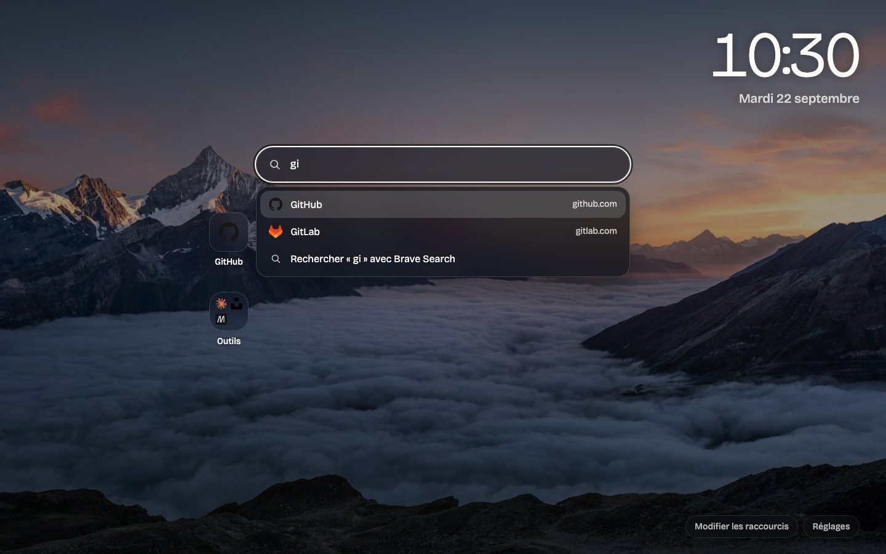

# Seuil

Page de démarrage pour Brave (et tout navigateur Chromium) : horloge, recherche sur le moteur de ton choix, fond d'écran Unsplash, raccourcis et dossiers de raccourcis.

Aucun build, aucune dépendance : du HTML, du CSS et des modules JavaScript.



## Installer

1. Ouvre `brave://extensions`.
2. Active le **Mode développeur** (en haut à droite).
3. Clique sur **Charger l'extension non empaquetée** et choisis ce dossier.
4. Ouvre un nouvel onglet. Brave demande une fois s'il faut conserver la nouvelle page : réponds **Conserver**.

Pour que la page s'affiche aussi au lancement du navigateur : `brave://settings/getStarted` → *Au démarrage* → **Ouvrir la page Nouvel onglet**.

Après une modification du code, clique sur la flèche de rechargement de l'extension dans `brave://extensions`.

## Utiliser

- **Rechercher ou lancer** : tape `/` pour placer le curseur dans le champ. Dès la première lettre, les raccourcis correspondants (ceux des dossiers compris) s'affichent sous le champ : `Entrée` ouvre le premier, `↑` `↓` choisissent, `Échap` ferme la liste pour lancer une recherche web. `Cmd/Ctrl + Entrée` ouvre dans un nouvel onglet. Une adresse (`exemple.fr`, `localhost:3000`) ouvre directement le site.
- **Clavier** : `Échap` dans le champ vide rend le focus à la page ; ensuite `1` à `9` ouvrent les neuf premiers raccourcis (`Maj` pour un nouvel onglet) et `e` bascule le mode modification.
- **Mots-clés** : `yt lofi` cherche sur YouTube, `gh brave` sur GitHub, `w Turing` sur Wikipédia, `mdn flexbox` sur MDN. La liste se modifie dans les réglages.
- Les raccourcis occupent la première rangée, les dossiers la seconde.
- **Ouvrir tout un dossier** : clic molette sur un dossier (ou Cmd/Ctrl + clic) ouvre tous ses raccourcis dans des onglets d'arrière-plan, à la suite de l'onglet courant.
- **Modifier les raccourcis** (en bas à droite) : ajoute des raccourcis et des dossiers, clique sur une tuile pour la modifier, glisse-la pour la déplacer. Une suppression peut être annulée pendant quelques secondes. Déposer un raccourci au centre d'un dossier l'y range ; depuis un dossier ouvert, le déposer sur la zone « sortir du dossier » (ou hors de la fenêtre) le ramène à l'accueil.
- **Réglages** : moteur de recherche, horloge, fond d'écran, couleur d'accent, icônes, export et import de la configuration.
- **Icônes** : par défaut, Brave fournit celles des sites déjà visités (les autres ont un globe gris) et rien ne sort du navigateur. L'option « Via DuckDuckGo » les couvre tous, mais DuckDuckGo reçoit alors la liste de tes sites.

### Fond d'écran

| Source | Clé Unsplash | Ce que ça fait |
| --- | --- | --- |
| Une photo précise | facultative | Colle l'adresse d'une page photo Unsplash ou d'une image. Avec une clé, le crédit du photographe s'affiche. |
| Photos par thème | requise | Photo aléatoire selon un thème ou des collections, renouvelée à chaque onglet, toutes les 15 minutes, chaque heure, chaque jour ou à la demande. |
| Un dossier d'images de mon ordinateur | — | Choisis un dossier : ses images (sous-dossiers compris) sont copiées dans le navigateur, ramenées à la taille de l'écran, puis tirées au hasard au rythme choisi. |
| Une image de mon ordinateur | — | L'image est stockée dans le navigateur. |

La clé d'accès s'obtient gratuitement sur <https://unsplash.com/developers> (créer une application, copier l'*Access Key*). Elle est limitée à 50 requêtes par heure ; le mode « à chaque nouvel onglet » en consomme deux par onglet.

Une extension ne peut pas relire un dossier du disque par elle-même (l'API File System Access est désactivée dans Brave) : le dossier est donc importé une fois. Un nouvel import remplace la bibliothèque, ou s'y ajoute si la case « Ajouter aux images déjà importées » est cochée. Les formats que le navigateur ne décode pas (HEIC, RAW) sont ignorés.

La bibliothèque s'affiche en vignettes dans les réglages, avec un bouton pour retirer une image. Sur la page, « Retirer cette image » écarte celle qui est affichée. Les deux se défont avec « Annuler ».

Quand « Assombrir davantage les photos claires » est coché, le voile se renforce automatiquement sur une image lumineuse, en mesurant les zones derrière l'horloge et les tuiles.

L'intervalle de rotation se règle dans *Changer de photo* : un des préréglages, ou « À un intervalle de mon choix » pour saisir un nombre de minutes, d'heures ou de jours (1 minute au minimum). Si l'onglet reste ouvert, la rotation continue à cet intervalle.

L'image affichée est gardée en cache (IndexedDB) : pas d'attente réseau à l'ouverture d'un onglet. En mode « par thème », la photo suivante est téléchargée en arrière-plan et montrée au prochain onglet.

### Sauvegarde

Tout est stocké dans `chrome.storage.local`, propre à l'extension (Brave Sync ne le synchronise pas ; désinstaller l'extension l'efface). **Réglages → Sauvegarde** exporte un fichier `seuil-AAAA-MM-JJ.json` avec raccourcis, mots-clés et réglages, et l'importe sur une autre machine. Par défaut la clé Unsplash n'y figure pas, ce qui rend le fichier partageable ; une case permet de l'inclure pour ta sauvegarde perso. Importer un fichier sans clé conserve celle déjà en place.

Après un mois sans export, un rappel discret apparaît en bas de la page, avec « Exporter maintenant » et « Plus tard » (qui le repousse d'un mois).

Plusieurs onglets ouverts restent synchronisés : une modification faite dans l'un apparaît aussitôt dans les autres, qui repartent de cette version au lieu de l'écraser.

## Limite connue

Sur une page Nouvel onglet fournie par une extension, Chromium place le curseur dans la barre d'adresse, pas dans la page. D'où le raccourci `/`.

## Organisation

```
manifest.json      Manifest V3, remplace la page Nouvel onglet
newtab.html        Structure de la page et des boîtes de dialogue
css/newtab.css     Styles
js/main.js         Démarrage, horloge, synchronisation entre onglets
js/search.js       Lanceur de raccourcis, mots-clés, recherche web
js/icons.js        Nom et icône d'un raccourci
js/toast.js        Bandeau d'annulation
js/store.js        Configuration (chrome.storage.local), valeurs par défaut
js/wallpaper.js    Unsplash, cache IndexedDB, affichage du fond
js/tiles.js        Raccourcis, dossiers, mode édition, glisser-déposer
js/settings.js     Panneau de réglages, export et import
fonts/             Bricolage Grotesque (licence OFL), embarquée
tests/             Tests Playwright (voir ci-dessous)
```

Pour travailler sur la page hors extension : `npm run serve` puis `http://127.0.0.1:8765/newtab.html`. La configuration passe alors par `localStorage` et les favicons sont remplacées par des initiales.

## Tests

Des tests de bout en bout Playwright couvrent la recherche, les tuiles, les réglages et le fond d'écran, sur la page servie hors extension (`tests/`). Ils simulent ce qui dépend du navigateur : `chrome.tabs` pour le clic molette, les événements de glisser-déposer, les fichiers choisis pour un dossier d'images.

```
npm install
npx playwright install chromium   # une fois
npm test                          # ou npm run test:ui pour l'interface
```

Le serveur local est lancé automatiquement. Un test a besoin du réseau (il charge une image Unsplash) ; il présente un User-Agent ordinaire, car Unsplash refuse les navigateurs headless.

Ce que les tests ne couvrent pas, parce que cela n'existe que dans l'extension chargée dans Brave : la synchronisation par `chrome.storage.onChanged`, les favicons du navigateur, et le chargement d'une page photo Unsplash (`unsplash.com/photos/…`), qui repose sur les `host_permissions` pour passer CORS.

## Licence

MIT, voir `LICENSE`. La police Bricolage Grotesque est sous SIL Open Font License 1.1 (`fonts/OFL.txt`).
